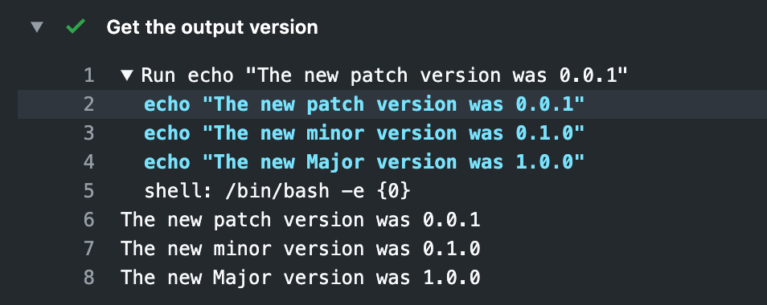

Github action for getting the next semver.

Example:
========
    on: [push]
    
    jobs:
      my-increment-semver-job:
        runs-on: ubuntu-latest
        name: A job to test incrementing the version of a repository
        steps:
    
    #      Note Checkout is required for ${GITHUB_WORKSPACE} to be not empty
          - name: Checkout
            uses: actions/checkout@v1
    
    
    #     Examples
          - name: Increment Step Patch
            id: increment-semver-patch
            uses: Benbentwo/increment-semver@master
            with:
              version-level: '-p'
    
          - name: Increment Step Minor
            id: increment-semver-minor
            uses: Benbentwo/increment-semver@master
            with:
              version-level: '-m'
    
          - name: Increment Step Major
            id: increment-semver-major
            uses: Benbentwo/increment-semver@master
            with:
              version-level: '-M'
    
          # Use the output from the `Increment Step X` step
          - name: Get the output version
            run: |
              echo "The new patch version was ${{ steps.increment-semver-patch.outputs.version }}"
              echo "The new minor version was ${{ steps.increment-semver-minor.outputs.version }}"
              echo "The new Major version was ${{ steps.increment-semver-major.outputs.version }}"

Output:


Shell Script: increment-semver
===========

Increment semantic versioning strings in shell scripts.

```shell
$ ./increment_version.sh
usage: increment_version.sh [-Mmp] major.minor.patch

$ ./increment_version.sh -p 0.0.0
0.0.1

$ ./increment_version.sh -m 0.0.3
0.1.0

$ ./increment_version.sh -M 1.1.15
2.0.0

$ ./increment_version.sh -Mmp 2.3.4
3.1.1
```

## TODO

 - Ideally this could be done as JS or something, its kind of annoying having every action build this docker image every run. granted theres sometimes caching but the run time of building this docker image could add up on private repos where actions aren't free. ideally it just runs with no build since thats all its doing
 - Add Docs for common use cases, should be clear (like a new release) since I already do it elsewhere
